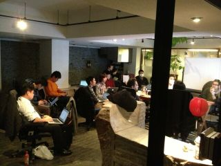

スタッフ募集のお知らせ
======================

PyCon APACではスタッフを募集しています。

スタッフに必要な資格は特にありません。Pythonに詳しくなくてもOKです。

* 「大きなイベントの運営に関わってみたい」
* 「Pythonってよく分からないけど面白そう」
* 「とにかく友達が欲しい！」

このぐらいの軽い気持ちで参加できます。

スタッフは、原則として月1回のミーティングに参加することになっていますが、必須ではありません。それぞれが、自分ができる範囲で関わっていけます。

「どんなことをしているのか分からない」という人は、 `PyCon JP Blog <http://pyconjp.blogspot.jp/>`_ で「1分で読めるミーティングレポート」を公開しているので、こちらで雰囲気をつかんでみてはいかがでしょうか？

スタッフになりたい人は、Google Group `pycon-organizers-jp <https://groups.google.com/forum/?fromgroups#!forum/pycon-organizers-jp>`_ に参加して、「スタッフになりたい」旨を投稿してください。

私たちと一緒に、楽しいイベントを作って行きましょう！
